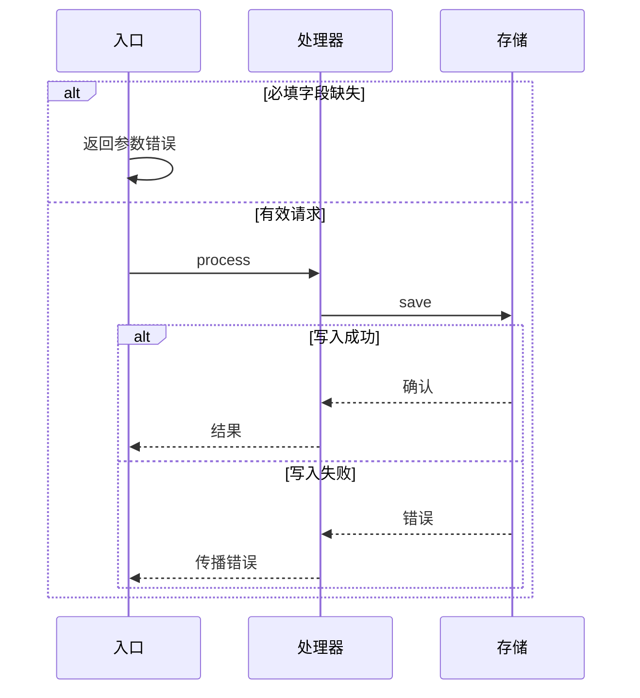

# 请求处理架构

入口校验请求,处理器转换数据,结果写入存储.

这是用户设计模式的示例骨架,没有对应源码.它不证明实现,部署或性能;用于展示速览与详解如何分工.[架构速览](overview.drawio).

## 完整结构

本示例范围只有三个逻辑模块.全部为同步调用,不涉及独立服务或网络部署.

## 模块与接口

### 入口

接收请求并检查必填字段.检查成功才调用处理器,失败直接返回参数错误,不写入存储.

| 接口 | 输入 | 输出/失败 | 关系 |
| --- | --- | --- | --- |
| submit | 请求对象 | 处理结果或参数错误 | 同步调用处理器 |

### 处理器

转换有效输入,将结果提交存储,写入成功后返回结果.当前设计没有重试机制,存储失败直接向入口传播.

| 接口 | 输入 | 输出/失败 | 关系 |
| --- | --- | --- | --- |
| process | 已校验请求 | 结果或存储错误 | 同步调用存储 |

### 存储

保存处理结果.这里仅声明逻辑存储职责,尚未指定内存,文件或数据库实现,不承诺持久化和事务能力.

| 接口 | 输入 | 输出/失败 | 关系 |
| --- | --- | --- | --- |
| save | 处理结果 | 成功确认或写入错误 | 被处理器调用 |

## 请求流程

## 依据与边界

来源类别:用户设计示例,不附虚构的路径/行号.

证据:

- 用户设计中的入口约定:先检查输入,失败直接返回参数错误.
- 用户设计中的处理器约定:同步提交存储,不重试.
- 用户设计中的存储约定:写入错误经处理器返回入口.

边界:

- 未知:数据格式,容量,存储实现,并发安全和部署方式.
- 无排期依据,不生成甘特图.
- 文件结构可由配套脚本检查;没有实际打开渲染时仍须声明视觉未复核.
